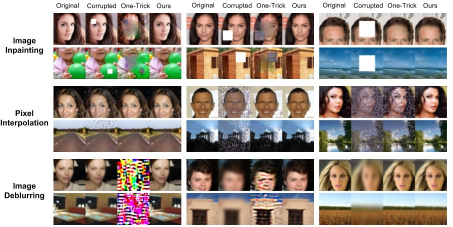

## From One-Trick Ponies to All-Rounders:  On-Demand Learning for Image Restoration
[Project Page](http://vision.cs.utexas.edu/projects/on_demand_learning/)<br/>



This repository contains the training code for our [arXiv paper on All-Rounders for Image Restoration](http://vision.cs.utexas.edu/projects/on_demand_learning/). We propose an on-demand learning algorithm for training image restoration models with deep convolutional neural networks that can generalize across difficulty levels. This repo contains our code for four image restoration tasks---image inpainting, pixel interpolation, image deblurring, and image denoising. The code is adapted from [Soumith's DCGAN Implementation](https://github.com/soumith/dcgan.torch) and [Deepak Pathak's Context Encoder Implementation](https://github.com/pathak22/context-encoder).

If you find our code or project useful in your research, please cite:

        @article{gao2016on-demand,
          title={From One-Trick Ponies to All-Rounders: On-Demand Learning for Image Restoration},
          author={Gao, Ruohan and Grauman, Kristen},
          journal={arXiv},
          year={2016}
        }


### Contents
0. [Preparation](#0-preparation)
1. [Image Inpainting](#1-image-inpainting)
2. [Pixel Interpolation](#2-pixel-interpolation)
3. [Image Deblurring](#3-image-deblurring)
4. [Image Denoising](#4-image-denoising)
5. [Sample Code for All Training Schemes](#5-sample-code-for-all-training-schemes)

### 0) Preparation

1. Install Torch: http://torch.ch/docs/getting-started.html

2. Install torch-opencv: https://github.com/VisionLabs/torch-opencv/wiki/Installation

3. Clone the repository

  ```Shell
  git clone https://github.com/rhgao/on-demand-learning.git
  ```
  
4. Download [CelebA](http://mmlab.ie.cuhk.edu.hk/projects/CelebA.html) or [SUN397](http://vision.cs.princeton.edu/projects/2010/SUN/) dataset, or prepare your own dataset. 

  ```Shell
  mkdir -p /your_path/my_train_set/images/
  # put all training images inside my_train_set/images/
  mkdir -p /your_path/my_val_set/images/
  # put all validation images inside my_val_set/images/
  mkdir -p /your_path/my_test_test/images/
  # put all testing images inside my_test_set/images/
  
  cd on-demand-learning/
  ln -sf /your_path dataset
  ```

5. [Optional] If you want to run a quick demo for the four image restoration tasks, please download our pre-trained models using the following script. As in 4, please also create a folder called `my_demo_images` and place all your testing images under a sub-folder called `images`.

6. [Optional] Install the Display Package, which enables you to track the training progress. If you don't want to install it, please set `display=0` in `train.lua`.

```Shell
luarocks install https://raw.githubusercontent.com/szym/display/master/display-scm-0.rockspec
#start the display server
th -ldisplay.start 8000
# on client side, open in browser: http://localhost:8000/
# You can then see the training progress in your browser window.
```

### 1) Image Inpainting
1. Demo

2. Train the model

### 2) Pixel Interpolation

### 3) Image Deblurring

### 4) Image Denoising

### 5) Sample Code for All Training Schemes
